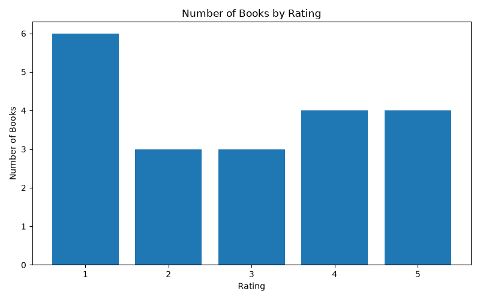
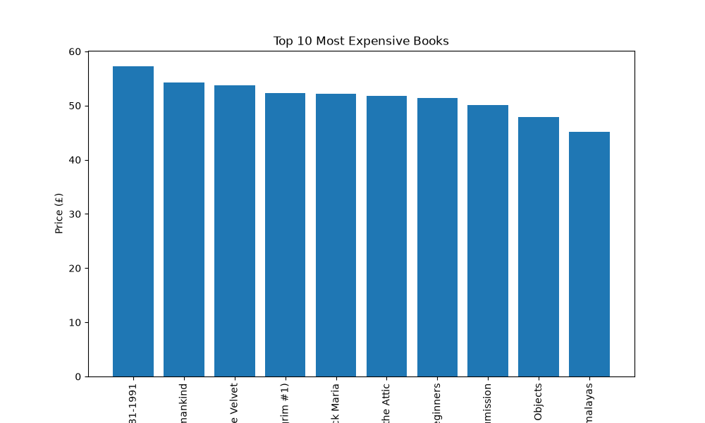

# CodeAlpha Web Scraping and Data Analysis Project

Task 1 Submission for the CodeAlpha Data Analytics Internship Program.

---

## Project Overview

This project demonstrates a complete Data Analytics workflow, starting from data collection through web scraping to data cleaning, analysis, and visualization.

Book data was scraped from the Books to Scrape website using Python and then processed to generate meaningful insights about book prices and ratings.

### Objectives

* Collect data from a website using web scraping techniques
* Clean and transform raw data
* Perform exploratory data analysis (EDA)
* Generate business insights
* Visualize findings using charts
* Practice Git and GitHub version control

---

## Data Source

Data was collected from:

https://books.toscrape.com/

Books to Scrape is a website specifically designed for web scraping practice and educational projects.

---

## Technologies Used

* Python
* Pandas
* Requests
* BeautifulSoup4
* Matplotlib
* Git
* GitHub

---

## Visualizations

### Rating Distribution



### Top 10 Most Expensive Books



---

## Project Structure

```text
CodeAlpha_WebScraping_Project
│
├── data
│   ├── raw
│   │   └── books_raw.csv
│   │
│   └── processed
│       └── books_clean.csv
│
├── screenshots
│   ├── books_rating_distribution.png
│   └── top_10_book_prices.png
│
├── src
│   ├── scraper.py
│   ├── cleaner.py
│   ├── analysis.py
│   └── visualization.py
│
├── requirements.txt
│
└── README.md
```

---

## Features

### Web Scraping

The scraper extracts:

* Book Title
* Price
* Rating

from the Books to Scrape website.

### Data Cleaning

The cleaning process:

* Removes unnecessary symbols
* Converts prices into numeric values
* Converts ratings into numerical values
* Prepares the dataset for analysis

### Data Analysis

The analysis generates:

* Average Book Price
* Highest Book Price
* Lowest Book Price
* Most Expensive Book
* Cheapest Book
* Rating Distribution
* Summary Statistics
* Top 5 Most Expensive Books
* Top 5 Cheapest Books
* Average Price by Rating
* Number of Books by Rating

### Data Visualization

The project generates:

* Rating Distribution Chart
* Top 10 Most Expensive Books Chart

---

## Sample Insights

Key findings from the analysis include:

* Average Book Price: £38.05
* Highest Book Price: £57.25
* Lowest Book Price: £13.99
* Rating 1 books were the most common in the dataset.
* Rating 3 books had the highest average price among all ratings.

---

## Installation

Clone the repository:

```bash
git clone https://github.com/origboemma/CodeAlpha_WebScraping_Project.git
```

Navigate to the project folder:

```bash
cd CodeAlpha_WebScraping_Project
```

Install required libraries:

```bash
pip install -r requirements.txt
```

---

## Requirements

Main libraries used:

* pandas
* requests
* beautifulsoup4
* matplotlib

---

## Usage

### Run the Web Scraper

```bash
python src/scraper.py
```

### Clean the Data

```bash
python src/cleaner.py
```

### Run Data Analysis

```bash
python src/analysis.py
```

### Generate Visualizations

```bash
python src/visualization.py
```

---

## Project Outcomes

This project demonstrates practical skills in:

* Web Scraping
* Data Collection
* Data Cleaning
* Exploratory Data Analysis (EDA)
* Data Visualization
* Python Programming
* Git Version Control
* GitHub Collaboration

---

## Author

Emmanuel Origbo

CodeAlpha Data Analytics Internship
